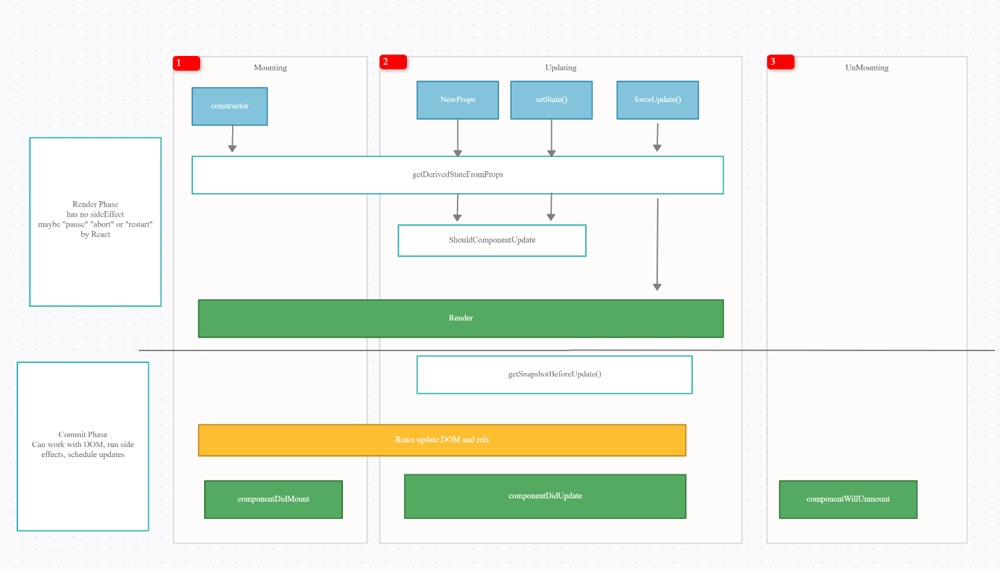

# ReactJS 2021

> Learn enough to be dangerous

**Flow**

> Idea -> Concept -> Build -> Operation

## Deployment

```bash
yarn global add surge
# login
surge
```

## Dev

- http://reactjs2021-sonnm.surge.sh
- [001](- http://reactjs2021-sonnm.surge.sh/)

## Main concept

### Props, State and Global State :thinking:

### Cách chia component trong ReactJS :thinking:

> **Container**: Smart Component - Stateful component

- Quản lý, xử lý dữ liệu
- Không quan tâm render UI ntn
- Chỉ quan tâm render cái gì
- Có thể chưa container con và các components

> **Component**: Dumb component - Stateless component

- Cho gì render đó
- Không biết dữ liệu đến từ đầu
- Thường chỉ có props, không có state
- Tái sử dụng, với props khác nhau, render khác nhau

> Refences

- https://medium.com/@dan_abramov/smart-and-dumb-components-7ca2f9a7c7d0
- https://gist.github.com/misostack/ad5b3f4e6bbf903b15e0fb8c8b1e2f43

### Component vs PureComponent

> PureComponent is exactly the same as Component except that it handles the shouldComponentUpdate method for you . When props or state changes, PureComponent will do a shallow comparison on both props and state. Component on the other hand won't compare current props and state to next out of the box

### Lifecycle



#### 1. Mounting

> Constructor

```js
class App extends React.PureComponent {
  constructor(props) {
    super(props); // always
    // optional
    if (true) {
      // redirect to another component
    }
    // properties
    this.DEFAULT_PAGE_SIZE = 10;
    // define state
    this.state = {
      items: [],
    };
  }
}
```

> ComponentDidMount

- Init data for component : API request, transform data, update state
- SetInterval, start observer
- Send tracking page view ( GA, FacebookPixel, ...)

```js
class App extends React.PureComponent {
  constructor(props) {
    super(props);

    this.setState({
      loading: true,
      items: [],
    });
  }

  async componentDidMount() {
    this.isComponentMounted = true;
    try {
      // Send GA page view tracking
      analytics.page("Home Page");
      // request API
      const items = await fetch("/items");
      if (this.isComponentMounted) {
        this.setState({ items, loading: false });
      }
    } catch (error) {
      console.error("Failed to fetch item list", error);
      if (this.isComponentMounted) {
        this.setState({ loading: false });
      }
    }
  }

  render() {
    const { loading, items } = this.state;
    if (loading) return <Loader />;
    return <ItemList items={items} />;
  }

  componentWillUnmount() {
    this.isComponentMounted = false;
  }
}
```

#### 2. Updating

> componentDidUpdate

- **Use with restriction**
- **USECASE** - incase you wanna update component when url parameter changes ( Eg: query params)

**CommonError**: can't call setState on an unmounted component.

Eg:

- User ở trang **A**, đang lấy dữ liệu từ API, sau đó update vào state.
- Nhưng trong lúc chưa lấy dữ liệu xong, user chuyển **qua trang B**
- Component **A bị unmount**
- Ngay sau đó, dữ liệu từ API được trả về, và tiếp tục gọi setState()
- Lúc này lỗi xảy ra do Component **A** đã bị hủy

[x] Solution

- Dùng 1 flag **isComponentMounted** để lưu trữ và kiểm tra được trạng thái hiện tại của component.

#### 3. Unmounting

> componentWillUnmount

- Clear timeout or interval if used
- Clear observables if used
- Reset data in redux if needed

## Practice

1.[Clock](./001/)

> Hiển thị đồng hồ tại múi giờ được chọn
